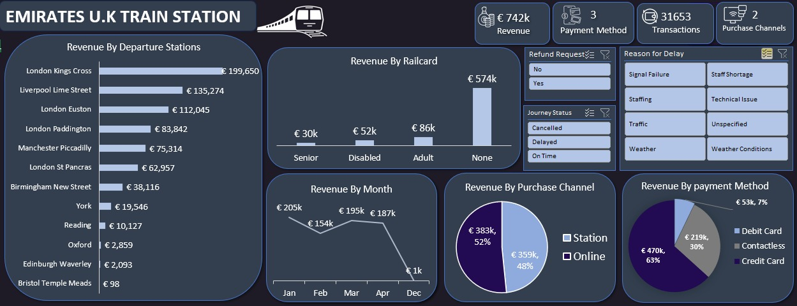

# 🚆 Excel Data Analysis Project: Emirates U.K Train Station

I recently worked on a real-world dataset to uncover insights behind customer complaints on delayed train journeys and inefficient ticket purchasing experiences at Emirates U.K Train Station.

Using Microsoft Excel, I built an interactive dashboard that highlights:

📍 Revenue by Departure Station

💳 Payment Method Distribution

🛍️ Ticket Purchase Channels (Online vs Station)

⏱️ Delay Reasons & Refund Requests

📉 Railcard Usage Impact

🔍 Key Findings:

✔️ Total Revenue: €742k across 31,653 transactions

✔️ London Kings Cross generated the highest revenue: €199,650

✔️ Online purchase is almost on par with Station purchase (48% vs 52%)

✔️ Liverpool Lime Street experienced the most delays and cancellations

✔️ Majority of customers do not use railcards opportunity for promotions

✔️ Contactless payments make up 30% of sales proper tracking is essential!

💡 What I Learned:

✅ Delays directly affect revenue and refund rates

✅ Data visualization can turn raw numbers into strategic business insights

✅ Excel is still a powerful tool for storytelling in analytics!

🔧 Tools Used:
📊 Microsoft Excel

🔽 Check out my dashboard below!

